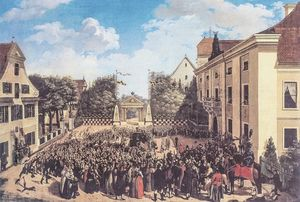
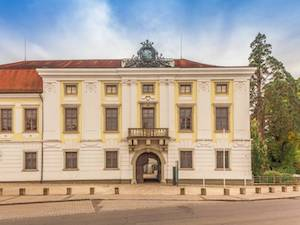
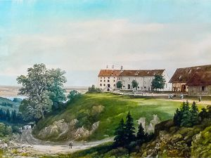
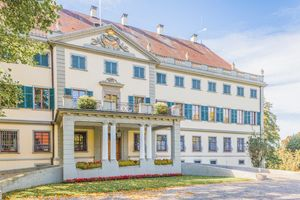

Burg Königsegg

Die Ersterwähnung des Geschlechternamens Königsegg am 14. Oktober 1251 weist auf die damals schon länger bestehende Höhenburg, den sogenannten Königsegg hin, der während der Stauferzeit errichtet wurde. Stammvater des Geschlechts bzw. mehrerer früher Linien war Meingoz (1155-1210), bei seinem ersten Auftreten welfischer Ministeriale. 1251 nannte sich sein Nachkomme Eberhard II. erstmals von Königsegg und stand mit der Familie bereits in staufischen Diensten. Familienrechtlich bedeutsam war der 19. Dezember 1311, als die Herren von Fronhofen/Königsegg „den Königsegg“ zu "ain recht Aigen" kauften.

Empfang von Kaiser Franz in Aulendorf

1347 wurde Ulrich I. von den Habsburgern zum ersten Landvogt in Oberschwaben aus dem Hause Königsegg erwählt. Mit wenigen Unterbrechungen hatte die Familie dieses Amt bis zum Ende des Alten Reiches inne. Doch nicht nur in Oberschwaben genossen die Königsegg das besondere Vertrauen des Hauses Habsburg, sondern auch im Elsaß.

Auch zum Deutschen Orden bestanden enge Verbindungen, so sind ab 1351 verschiedene Familienmitglieder als Deutschordensritter und Komture nachgewiesen, regelmäßige Kontakte zum Orden bestanden schon seit 1268. Und die Existenz einer preußischen Linie begann urkundlich 1405, als sich Eberhard VI. von Königsegg zum Hatzenturm bereits im Ordensland befand.

Die Erhebung in den Freiherrenstand genoß Hans VII. Frhr. von Königsegg 1510.

Schloss Aulendorf heute

Während des Bauernkrieges eroberte der Seehaufen auch Burg Königsegg, richtete aber kaum Schaden an.

1563/1564 kaufte Johann Jakob I. Frhr. zu Königsegg-Aulendorf die Grafschaft Rothenfels mit der Herrschaft (Ober)Staufen von den Grafen von Montfort. Ihre endgültige Gestalt erhielten die Grafschaften mit dem Vertrag vom 9. Oktober 1662 zwischen Hugo II. (Rothenfels) und seinem jüngsten Bruder Johann Georg II. (Aulendorf).

Gute hundert Jahre nach Erhebung in den Freiherrenstand erfolgten innerhalb weniger Jahre weitere Standeserhebungen und zuletzt schloß sich 1629 der Reichsgrafenstand an.

Schloss Königseggwald heute

Hatten die frühen Königsegger in welfischen, staufischen und auch württembergischen Diensten gestanden, wandten sich die beiden schwäbischen Linien infolge der Reformation den Habsburgern zu und bekleideten höchste Reichsämter. So ragt als bedeutender Politiker Graf Leopold Wilhelm zu Königsegg-Rothenfels hervor, der 1683 eine maßgebliche Rolle bei der Verteidigung Wiens während der türkischen Belagerung spielte.

Die Linien der Reichsgrafen von Königsegg-Rothenfels, zu Königsegg-Aulendorf und der Freiherren von Königsegg blühen heute noch in Ungarn, den oberschwäbischen Stammlanden und Schweden. Die Aulendorfer Linie hat unter ihrem derzeitigen Chef des Hauses S.E. Johannes Graf zu Königsegg - Aulendorf Stand und verbliebenen Besitz bewahrt, dessen Verwaltung seit 1994 in den Händen von S.E. Maximilian Erbgraf zu Königsegg - Aulendorf liegt.

