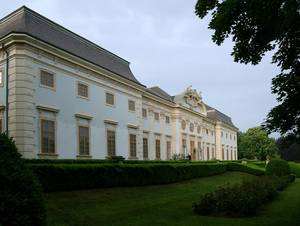

**SCHLOSS HALBTURN**, der bedeutendste Barockbau des Burgenlandes, diente einst dem Kaiserhaus als Jagd- und Sommerresidenz. Die Wiege des Weinguts SCHLOSS HALBTURN wurde in Jois (Jungenberg) begründet. Hier errichteten die Grafen Poth im Jahre 1214 durch den Kauf von 14 Kurien die ersten Weingärten der Herrschaft Ungarisch-Altenburg.

1960 wurden unter **Baron Paul Waldbott-Bassenheim** erstmals Weingärten am Wittmannshof, der nach einem alten Gutshof in unmittelbarer Nähe zu Schloss Halbturn benannten Lage, ausgepflanzt.

Im Jahr 2001 wurde der Traditionsbetrieb nahe der ungarischen Grenze mit größtem Ehrgeiz umstrukturiert. Auf Initiative von **Baronin Marietheres Waldbott-Bassenheim** und unter der Leitung von **Markus Graf zu Königsegg-Aulendorf** scheute man weder Kosten noch Mühen, um Weingut SCHLOSS HALBTURN als eines der Spitzenweingüter des Landes zu etablieren. Ein Großteil des rd. 50 ha umfassenden Weinguts wurde gerodet und neu ausgepflanzt. Darüber hinaus wurden die historischen Terrassen am Jungenberg revitalisiert.
 Auch im Keller blieb kein Stein auf dem anderen. Das Ergebnis sind der wahrscheinlich schönste Keller des Landes im bordelaiser Stil (Chai) und spartanische Kellertechnik vom Feinsten.

Heute steht das **Weingut SCHLOSS HALBTURN** im Besitz der Familien **Markus Graf zu Königsegg-Aulendorf**, **Max Erbgraf zu Königsegg-Aulendorf** und **Dieter Hoffmann-Unzog**. Dies sichert eine stabile Basis für die Herausforderungen der Zukunft und den weiteren Ausbau des Weinguts.

Bereits mit dem ersten "neuen" Jahrgang (2002) bewies das internationale Team von SCHLOSS HALBTURN seine Qualitäten. Bestätigt wird dieser bedingungslose Qualitätsanspruch durch zahlreiche Auszeichnungen im In- und Ausland (u.a. Falstaff Sortensieger, Gewinner des VINARIA Rotweinfinales, Sieger Pinot Noir Cup in Deutschland, Goldmedaillen in Japan und London).

[Mehr Informationen...](https://www.weingut-schlosshalbturn.com/){:target="_blank"}